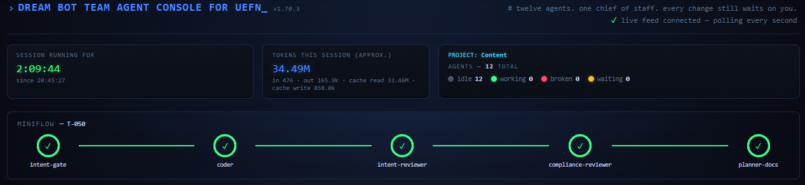
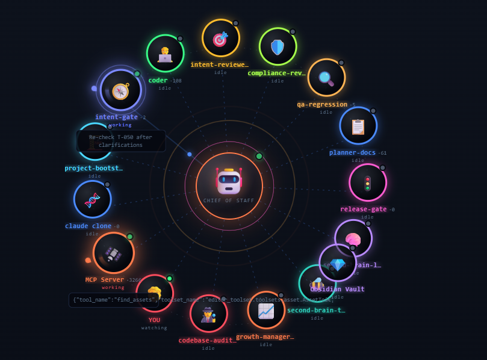
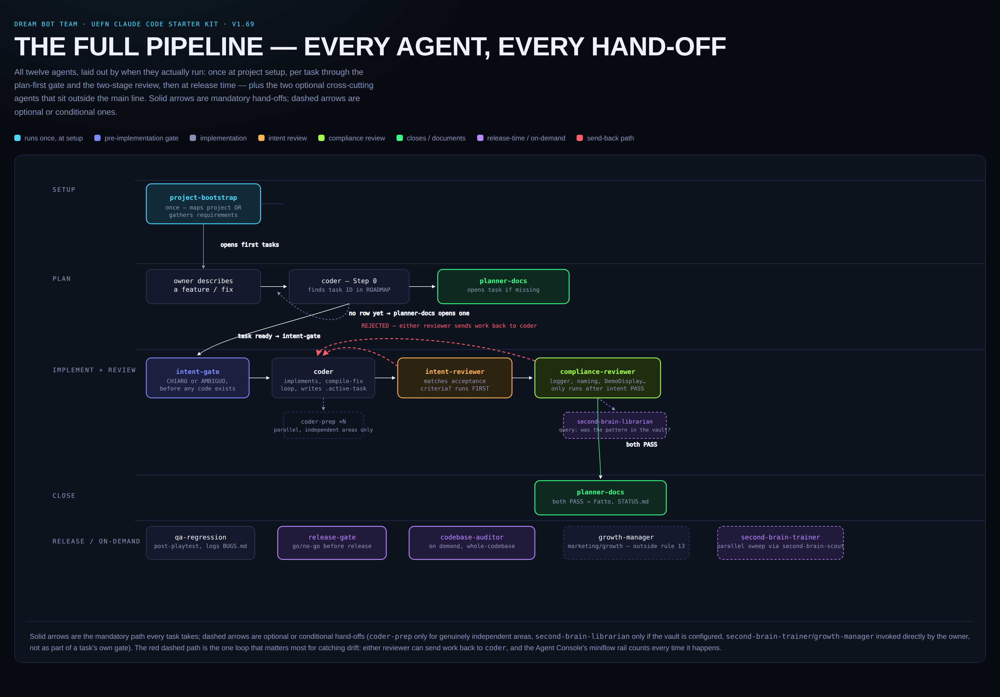
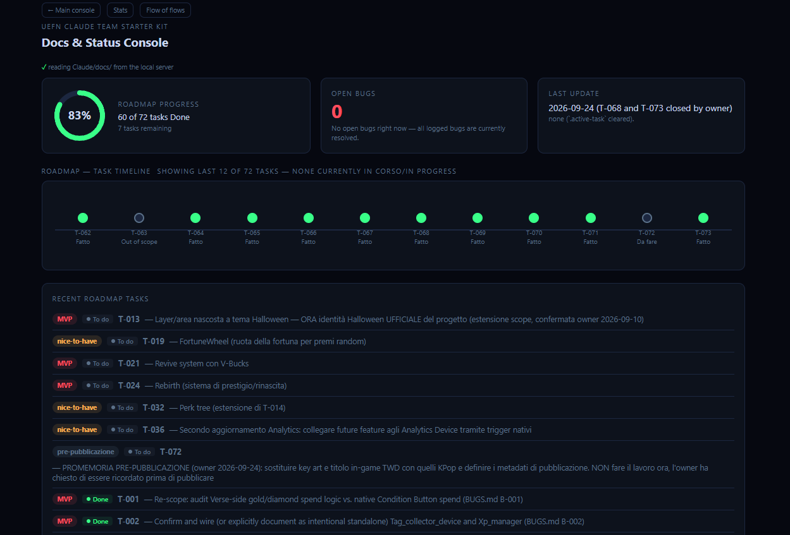
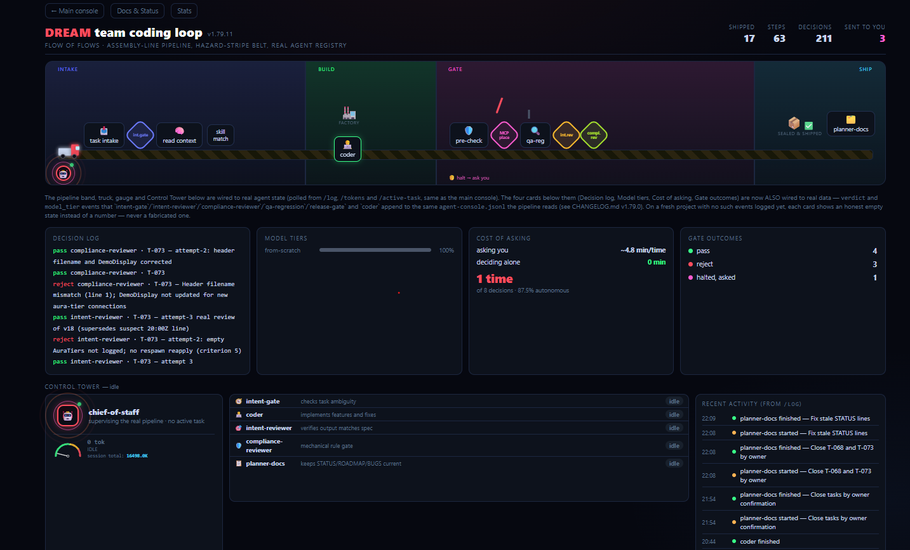

# UEFN Dream Bot Team

A Claude Code multi-agent starter kit for building UEFN (Unreal Editor for Fortnite) experiences —
twelve specialized subagents, each with one narrow job, instead of one general-purpose assistant
trying to do everything and stepping on its own toes.

Built by someone juggling ~50 UEFN islands at once. Free, fully documented, works for one island or
fifty.

## Screenshots

**The Agent Console header** — session stats, token usage, and the "miniflow" rail tracking a
task live through its five gated stages (intent-gate → coder → intent-reviewer →
compliance-reviewer → planner-docs):



**The full Agent Console** — the header above, plus every agent's live status at a glance:



**The full pipeline** — every agent and every hand-off, end to end:



## What's new (v1.79)

- **Docs & Status console** (`agent-console-docs.html`) — a second dashboard page reading your
  project's real `Claude/docs/*.md` files (ROADMAP.md, BUGS.md, STATUS.md, SPEC.md,
  RETENTION-NOTES.md, RELEASE-READINESS.md) straight off disk, no hardcoded sample data. Shows a
  roadmap-progress ring, a "Recent roadmap tasks" list (code — description, status, priority) and
  a "Recent bug backlog" list (severity, status, description) sorted so what's still open surfaces
  first, plus a click-to-open readable render of every doc.
- **Flow of Flows console** (`agent-console-flow.html`) — an assembly-line-style pipeline
  visualization of the same real agent activity (start/stop events, token usage, active task),
  with a "Control Tower" token gauge that now correctly drops back to idle instead of sticking to
  a stale agent after a crashed/killed session.
- **Server concurrency fix** (`agent-console-server.ps1` / `.py`) — the local dashboard server no
  longer blocks every open tab for up to 10 seconds when a Fortnite API lookup is slow.
- New shared skills: `game-ui-designer`, `genre` (roguelike/survival pattern evidence), and
  `fortnite-growth-lessons`.

**Docs & Status** — roadmap progress ring, open-bug count, a "Recent roadmap tasks" list and a
"Recent bug backlog" list, both sorted so what's still open surfaces first:



**Flow of Flows** — the same real agent activity as an assembly-line pipeline, with a Control
Tower token gauge and a live decision log:



Full details for every version in [`CHANGELOG.md`](CHANGELOG.md).

## What's in the box

- **Twelve agents**, each doing one job: project setup, an independent ambiguity check before any
  code is written, the actual Verse coding with a mandatory compile-fix loop, two separate review
  gates (spec adherence, then mechanical rule conformance — never the same agent grading both),
  regression/bug hunting after every playtest, documentation that stays current, a go/no-go release
  check, and an optional second-brain (Obsidian) integration for reusable mechanics.
- **A plan-first workflow**: every code change ties to a tracked task, and a task isn't marked done
  until two independent reviewers have both signed off — no agent grades its own work.
- **A shared cross-project skill** (`uefn-lessons`) that never resets: something learned fixing a
  bug on project #12 stops being invisible on project #37.
- **An optional real-time Agent Console** — a local dashboard showing which agent is working, a
  live "miniflow" rail for the review-gate sequence, MCP server activity, and token usage.
- **`mcp-tool-contracts`**: a single source of truth for which MCP tool to use for which check, so
  the same instruction never quietly diverges across three different agent files.

## Getting started

Read [`SETUP-GUIDE.md`](SETUP-GUIDE.md) first — it covers both setup phases (once per machine, then
once per project), explains what each agent does and why, and has a troubleshooting section for the
Agent Console and the MCP connection. Setup is deliberately manual in a few places rather than a
one-click script, so you see exactly what's being installed.

Full version history is in [`CHANGELOG.md`](CHANGELOG.md).

## Repo layout

```
project-template/       Files copied into each UEFN project's Content/ folder (hooks, docs
                         templates, the Agent Console, per-project CLAUDE.md)
user-level-agents/       The 14 agent definitions, installed once into ~/.claude/agents/
user-level-memory/       Base rules loaded in every session, installed into ~/.claude/CLAUDE.md
user-level-skills/       Shared skills (uefn-lessons, mcp-tool-contracts, and others),
                         installed once into ~/.claude/skills/
second-brain-template/   Optional Obsidian vault template for the second-brain integration
SETUP-GUIDE.md           Full setup instructions and troubleshooting
CHANGELOG.md             Version history
```

## Contributing

Issues and pull requests are welcome. If you hit a bug in the kit itself (not in your own UEFN
project), open an issue with the agent/hook involved and what you expected vs. what happened.

## License

MIT — see [`LICENSE`](LICENSE). Use it, fork it, ship it in your own team's setup.
